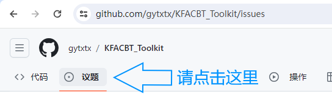
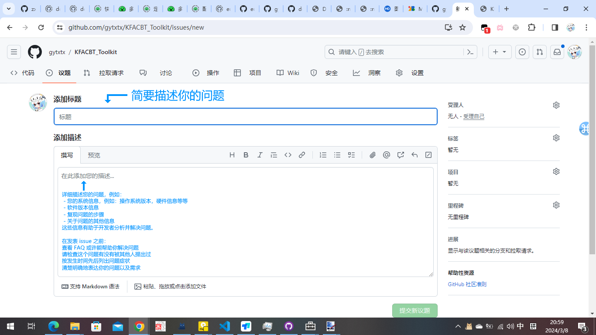

## 向开发者提供建议或反馈

如果要提供建议和反馈，可以使用 `GitHub Issue` 来向我提供反馈。

首先，请跳转到 [GitHub Repo](https://github.com/gytxtx/KFACBT_Toolkit)

之后，点击此处(一般为 `issue`)：

之后点击 “创建议题”：

之后，详细描述您的问题：

具体见下图或 [提问的智慧](https://github.com/ryanhanwu/How-To-Ask-Questions-The-Smart-Way)：

之后，点击“提交新议题”按钮

恭喜你，您的反馈已经提交成功！